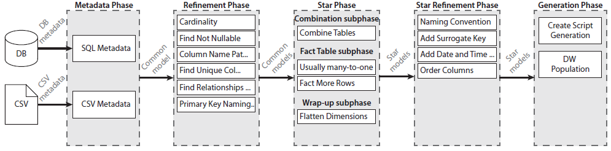

# DWStar
**Note:** DWStar is a prototype made as part of a University project, and the primary focus has been on creating a conceptual model. As such, the code should not be used in production, but rather as inspiration for somebody to implement.

DWStar is a prototype for automatic star schema generation.

The illustration below depicts how DWStar does this by extracting information from data sources and then gradually transforming the data through a series of phases that eventually produces a set of candidates for star schemas.

DWStar is meant as a platform on which one can add, remove, configure, and implement new modules to fit their needs. The modules are based on several heuristics that originate both from reviewing related literature as well as talks with BI practitioners. The details of each phase and some of the existing modules are presented below.

## Metadata Phase
The *Metadata Phase* is responsible for extracting metadata from each data source to be processed. Here each module is specialized in extracting metadata from a particular type of data source.
Notably, the output of this phase is a *common model* which provides a homogeneous view of the metadata, regardless of whether the metadata originates from structured or semi-structured data sources, etc. A key concept within the common model is *confidence*, which indicates to which degree of certainty we trust in a description of the metadata. For instance, this concept can help us quantify how likely we think a column from a CSV is of being unique.

## Refinement Phase
The *Refinement Phase* applies various heuristics to enrich the common model for the subsequent phases. Again, these are most useful for metadata from semi-structured or unstructured data sources where the schema isn't set in stone. 
The provided modules here can do the following:
 - Infer the cardinality between tables by examining a sample of the data to see if a value from one table appears multiple times in another table
 - Infer nullability by seeing if null appears within a sample of data of a column
 - Infer column names from values by running the data through DBpedia which gives us a list of classifications based on the string provided
 - Infer if a column is unique by looking a sample of the values
 - Derives primary keys by seeing which columns are both unique and not nullable
 - Calculate with more confidence which columns are likely the primary key(s) based on whether a column is contains key phrases such as "ID", "Key", "no", etc.

## Star Phase
The *Star Phase* takes in the common models once they've been refined and converts them to star schemas. It contains 3 sub-phases:
 - *Combination sub-phase*, which is an optional sub-phase that  tries to combine multiple tables to create better fact tables
 - *Fact Table sub-phase*, which assigns confidence to how likely a table is to be a fact table. This includes modules that identify fact tables according to number of many-to-one relationships and rows present
 - *Wrap-Up sub-phase*, which refines the dimensions for each of the fact table candidates. This includes a module that flattens tables to create more appropriate dimensions

The output of this phase is *star models* which is a model of star schemas which again contains a *confidence* according to the heuristics used.

## Star Refinement Phase
The *Star Refinement Phase* adds refinements after the candidates for star schemas have been selected. These modules include:
- Adding naming conventions to table names such as "fact_" or "dim_"
- Add surrogate keys to dimensions
- Create separate time and date dimensions
- Move columns from a fact table deemed more fitting to be in a junk dimension

## Generation Phase
The last phase is the *Generation Phase* which serves two purposes. First, it translates the star schema candidates into a physical format. The existing module creates SQL scripts for SQL server to generate the fact table and dimensions. Secondly, this phase also has the possibility of making scripts for a given database that populates the resulting tables from the data sources.
